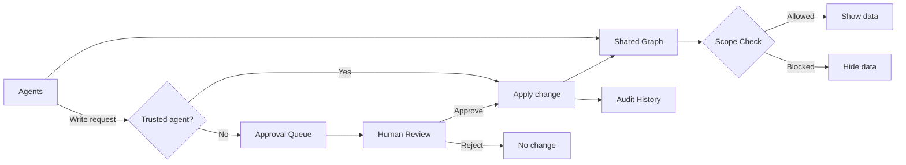

---

## 🚀 About

Just as developers use GitHub to collaborate on code, agents need Nebula to coordinate context.  
Nebula is **Git for agent context & tasks** - a secure system of record with scopes, approvals, audit trails, and rollback.  
MCP-first by design, CLI today, **web UI & shared cloud** next.

> Nebula is perfect whether you’re building with **multiple unrelated agents** and need **real collaboration** (not copy-pasted prompts and messy markdown files), or if you just want agents to **manage your notes** and **store context** any approved agent can use.

## Quickstart

```bash
curl -fsSL https://nebula.gravitrone.com/install.sh | bash
nebula start   # starts the API & MCP server
nebula         # open the CLI
```

## Vision

Nebula’s vision is to make agent context a **reliable platform**. Local-first stays core, but you’ll be able to **push/commit your context to the cloud when you want**. The mission is to replace messy markdown workflows with a real multi-agent communication protocol, with scopes, approvals, and auditability baked in, so shared context becomes as normal as shared code.

## Architecture

Nebula keeps your data as a connected graph (projects, context, jobs, logs, files).  
Each agent sees only what its scopes allow.  
Untrusted write requests go through approval first.



> Simple rule - if scope says no, data stays hidden. if trust says no, writes need approval.

## Resources

- Changelog lives in [changelog/](changelog/) or here → [nebula.gravitrone.com/changelog](https://nebula.gravitrone.com/changelog)
- Docs live in [docs/](docs/) or here → [nebula.gravitrone.com/docs](https://nebula.gravitrone.com/docs)

## Contributing

PRs are welcome.

Before submitting:
- Read the [CLA](docs/CLA.md) and sign it by commenting: "I have read the CLA Document and I hereby sign the CLA"
- For major changes, open an issue first to align on scope
- Keep changes focused and include tests/docs when relevant


## FAQ

<details>
<summary><b>Why not just use Markdown or Notion?</b></summary>
<br>
They’re human-first. Nebula is agent-first - scopes, approvals, audit, rollback.<br>
It lets <b>unrelated agents/teams sync on shared context</b> while a human keeps full control - like GitHub, but for agent memory.<br>
You decide <b>who can access what</b> via scopes, so some context is shared and some stays private.
<br><br>
</details>

<details>
<summary><b>What’s the difference from a vector DB?</b></summary>
<br>
Nebula is a secure system-of-record with <b>graph connections</b> (entities, relationships, logs).<br>
We also support <b>embedding search</b> with privacy scopes - local by default, and soon compatible with your favorite providers (e.g. OpenAI).
<br><br>
</details>

<details>
<summary><b>Is it open-source?</b></summary>
<br>
Yep, → <a href="LICENSE">Apache License 2.0</a>.
<br><br>
</details>

<details>
<summary><b>Is there a cloud version?</b></summary>
<br>
Coming. Web UI & shared cloud for seamless sync across your devices.
<br><br>
</details>

<details>
<summary><b>Can I rollback changes?</b></summary>
<br>
Yes - full audit log & one-click revert to any previous version.
<br><br>
</details>

<details>
<summary><b>Is my data private?</b></summary>
<br>
Yes. Data lives on your machine by default. Scopes control exactly who can read/write.
<br><br>
</details>

<details>
<summary><b>Can I import Markdown or existing notes?</b></summary>
<br>
JSON/CSV now. Full Markdown ingest is on the roadmap - but you can already ask any agent to do it.
<br><br>
</details>

<details>
<summary><b>What’s the CLI for?</b></summary>
<br>
It’s the human control panel - browse & add data, approve changes, run ops.<br>
Agents connect through <b>MCP/REST</b> instead.
<br><br>
</details>


## License

[Apache License 2.0](LICENSE)
