# Database Schema

> Auto-generated from SQLAlchemy models. Do not edit manually.
> Regenerate with: `make docs-schema`

## Entity Relationship Diagram

```mermaid
erDiagram
    agent_enrollment_sessions {
        UUID agent_id FK
        UUID approval_request_id FK
        TEXT status
        TEXT enrollment_token_hash
        ARRAY requested_scope_ids
        ARRAY granted_scope_ids
        BOOLEAN requested_requires_approval
        BOOLEAN granted_requires_approval
        TEXT rejected_reason
        UUID approved_by
        DATETIME approved_at
        DATETIME redeemed_at
        DATETIME expires_at
        UUID id PK
        DATETIME created_at
        DATETIME updated_at
    }
    agents {
        TEXT name
        TEXT description
        TEXT system_prompt
        ARRAY scopes
        ARRAY capabilities
        UUID status_id FK
        TEXT notes
        BOOLEAN requires_approval
        UUID id PK
        DATETIME created_at
        DATETIME updated_at
    }
    api_keys {
        UUID entity_id FK
        UUID agent_id FK
        TEXT key_hash
        TEXT key_prefix
        TEXT name
        ARRAY scopes
        DATETIME last_used_at
        DATETIME expires_at
        DATETIME revoked_at
        DATETIME created_at
        UUID id PK
    }
    approval_requests {
        TEXT job_id
        TEXT request_type
        UUID requested_by
        TEXT change_details
        TEXT status
        UUID reviewed_by
        DATETIME reviewed_at
        TEXT review_notes
        DATETIME created_at
        TEXT execution_error
        UUID id PK
    }
    audit_log {
        TEXT table_name
        TEXT record_id
        TEXT action
        TEXT changed_by_type
        UUID changed_by_id
        TEXT old_values
        TEXT new_values
        ARRAY changed_fields
        TEXT change_reason
        DATETIME changed_at
        TEXT notes
        UUID id PK
    }
    context_items {
        ARRAY privacy_scope_ids
        TEXT title
        TEXT url
        TEXT source_type
        TEXT content
        UUID status_id FK
        DATETIME status_changed_at
        TEXT status_reason
        ARRAY tags
        TEXT source_path
        UUID id PK
        DATETIME created_at
        DATETIME updated_at
    }
    entities {
        ARRAY privacy_scope_ids
        TEXT name
        UUID type_id FK
        UUID status_id FK
        DATETIME status_changed_at
        TEXT status_reason
        ARRAY tags
        TEXT source_path
        UUID id PK
        DATETIME created_at
        DATETIME updated_at
    }
    entity_types {
        TEXT name
        TEXT description
        BOOLEAN is_builtin
        BOOLEAN is_active
        TEXT notes
        JSONB value_schema
        UUID id PK
        DATETIME created_at
        DATETIME updated_at
    }
    external_refs {
        TEXT node_type
        TEXT node_id
        TEXT system
        TEXT external_id
        TEXT url
        TEXT notes
        UUID id PK
        DATETIME created_at
        DATETIME updated_at
    }
    files {
        TEXT filename
        TEXT uri
        TEXT file_path
        TEXT mime_type
        BIGINT size_bytes
        TEXT checksum
        ARRAY privacy_scope_ids
        UUID status_id FK
        ARRAY tags
        TEXT notes
        TEXT source_path
        UUID id PK
        DATETIME created_at
        DATETIME updated_at
    }
    jobs {
        TEXT id PK
        TEXT title
        TEXT description
        UUID assigned_to
        UUID agent_id FK
        UUID status_id FK
        VARCHAR priority
        TEXT parent_job_id FK
        DATETIME due_at
        DATETIME completed_at
        ARRAY privacy_scope_ids
        TEXT status_reason
        DATETIME status_changed_at
        DATETIME created_at
        DATETIME updated_at
    }
    log_types {
        TEXT name
        TEXT description
        BOOLEAN is_builtin
        BOOLEAN is_active
        TEXT notes
        JSONB value_schema
        UUID id PK
        DATETIME created_at
        DATETIME updated_at
    }
    logs {
        UUID log_type_id FK
        DATETIME timestamp
        TEXT content
        ARRAY privacy_scope_ids
        UUID status_id FK
        ARRAY tags
        TEXT notes
        TEXT source_path
        UUID id PK
        DATETIME created_at
        DATETIME updated_at
    }
    privacy_scopes {
        TEXT name
        TEXT description
        BOOLEAN is_builtin
        BOOLEAN is_active
        TEXT notes
        UUID id PK
        DATETIME created_at
        DATETIME updated_at
    }
    protocols {
        TEXT name
        TEXT title
        INTEGER version
        TEXT content
        TEXT protocol_type
        ARRAY applies_to
        ARRAY privacy_scope_ids
        UUID status_id FK
        ARRAY tags
        BOOLEAN trusted
        TEXT notes
        TEXT source_path
        UUID id PK
        DATETIME created_at
        DATETIME updated_at
    }
    relationship_types {
        TEXT name
        TEXT description
        BOOLEAN is_symmetric
        BOOLEAN is_builtin
        BOOLEAN is_active
        TEXT notes
        UUID id PK
        DATETIME created_at
        DATETIME updated_at
    }
    relationships {
        TEXT source_type
        TEXT source_id
        TEXT target_type
        TEXT target_id
        UUID type_id FK
        UUID status_id FK
        DATETIME status_changed_at
        TEXT notes
        DATETIME created_at
        DATETIME updated_at
        UUID id PK
    }
    semantic_search {
        TEXT source_type
        TEXT source_id
        INTEGER segment_index
        ARRAY scopes
        TEXT notes
        DATETIME created_at
        UUID id PK
    }
    statuses {
        TEXT name
        TEXT description
        VARCHAR category
        BOOLEAN is_builtin
        BOOLEAN is_active
        TEXT notes
        UUID id PK
        DATETIME created_at
        DATETIME updated_at
    }
    agent_enrollment_sessions }o--|| agents : "agent_id"
    agent_enrollment_sessions }o--|| approval_requests : "approval_request_id"
    agents }o--|| statuses : "status_id"
    api_keys }o--|| agents : "agent_id"
    api_keys }o--|| entities : "entity_id"
    context_items }o--|| statuses : "status_id"
    entities }o--|| entity_types : "type_id"
    entities }o--|| statuses : "status_id"
    files }o--|| statuses : "status_id"
    jobs }o--|| statuses : "status_id"
    jobs }o--|| jobs : "parent_job_id"
    jobs }o--|| agents : "agent_id"
    logs }o--|| log_types : "log_type_id"
    logs }o--|| statuses : "status_id"
    protocols }o--|| statuses : "status_id"
    relationships }o--|| statuses : "status_id"
    relationships }o--|| relationship_types : "type_id"
```

## Tables

### agent_enrollment_sessions

| Column | Type | Nullable | Key | Description |
|--------|------|----------|-----|-------------|
| agent_id | UUID | no | FK -> agents.id |  |
| approval_request_id | UUID | no | FK -> approval_requests.id |  |
| status | TEXT | no |  |  |
| enrollment_token_hash | TEXT | no |  |  |
| requested_scope_ids | ARRAY | no |  |  |
| granted_scope_ids | ARRAY | yes |  |  |
| requested_requires_approval | BOOLEAN | no |  |  |
| granted_requires_approval | BOOLEAN | yes |  |  |
| rejected_reason | TEXT | yes |  |  |
| approved_by | UUID | yes |  |  |
| approved_at | DATETIME | yes |  |  |
| redeemed_at | DATETIME | yes |  |  |
| expires_at | DATETIME | no |  |  |
| id | UUID | no | PK |  |
| created_at | DATETIME | no |  |  |
| updated_at | DATETIME | no |  |  |

### agents

| Column | Type | Nullable | Key | Description |
|--------|------|----------|-----|-------------|
| name | TEXT | no |  |  |
| description | TEXT | yes |  |  |
| system_prompt | TEXT | yes |  |  |
| scopes | ARRAY | no |  |  |
| capabilities | ARRAY | no |  |  |
| status_id | UUID | yes | FK -> statuses.id |  |
| notes | TEXT | yes |  |  |
| requires_approval | BOOLEAN | no |  |  |
| id | UUID | no | PK |  |
| created_at | DATETIME | no |  |  |
| updated_at | DATETIME | no |  |  |

### api_keys

| Column | Type | Nullable | Key | Description |
|--------|------|----------|-----|-------------|
| entity_id | UUID | yes | FK -> entities.id |  |
| agent_id | UUID | yes | FK -> agents.id |  |
| key_hash | TEXT | no |  |  |
| key_prefix | TEXT | no |  |  |
| name | TEXT | no |  |  |
| scopes | ARRAY | no |  |  |
| last_used_at | DATETIME | yes |  |  |
| expires_at | DATETIME | yes |  |  |
| revoked_at | DATETIME | yes |  |  |
| created_at | DATETIME | no |  |  |
| id | UUID | no | PK |  |

### approval_requests

| Column | Type | Nullable | Key | Description |
|--------|------|----------|-----|-------------|
| job_id | TEXT | yes |  |  |
| request_type | TEXT | no |  |  |
| requested_by | UUID | yes |  |  |
| change_details | TEXT | yes |  |  |
| status | TEXT | no |  |  |
| reviewed_by | UUID | yes |  |  |
| reviewed_at | DATETIME | yes |  |  |
| review_notes | TEXT | yes |  |  |
| created_at | DATETIME | no |  |  |
| execution_error | TEXT | yes |  |  |
| id | UUID | no | PK |  |

### audit_log

| Column | Type | Nullable | Key | Description |
|--------|------|----------|-----|-------------|
| table_name | TEXT | no |  |  |
| record_id | TEXT | no |  |  |
| action | TEXT | no |  |  |
| changed_by_type | TEXT | yes |  |  |
| changed_by_id | UUID | yes |  |  |
| old_values | TEXT | yes |  |  |
| new_values | TEXT | yes |  |  |
| changed_fields | ARRAY | yes |  |  |
| change_reason | TEXT | yes |  |  |
| changed_at | DATETIME | no |  |  |
| notes | TEXT | yes |  |  |
| id | UUID | no | PK |  |

### context_items

| Column | Type | Nullable | Key | Description |
|--------|------|----------|-----|-------------|
| privacy_scope_ids | ARRAY | no |  |  |
| title | TEXT | no |  |  |
| url | TEXT | yes |  |  |
| source_type | TEXT | yes |  |  |
| content | TEXT | yes |  |  |
| status_id | UUID | yes | FK -> statuses.id |  |
| status_changed_at | DATETIME | yes |  |  |
| status_reason | TEXT | yes |  |  |
| tags | ARRAY | no |  |  |
| source_path | TEXT | yes |  |  |
| id | UUID | no | PK |  |
| created_at | DATETIME | no |  |  |
| updated_at | DATETIME | no |  |  |

### entities

| Column | Type | Nullable | Key | Description |
|--------|------|----------|-----|-------------|
| privacy_scope_ids | ARRAY | no |  |  |
| name | TEXT | no |  |  |
| type_id | UUID | no | FK -> entity_types.id |  |
| status_id | UUID | yes | FK -> statuses.id |  |
| status_changed_at | DATETIME | yes |  |  |
| status_reason | TEXT | yes |  |  |
| tags | ARRAY | no |  |  |
| source_path | TEXT | yes |  |  |
| id | UUID | no | PK |  |
| created_at | DATETIME | no |  |  |
| updated_at | DATETIME | no |  |  |

### entity_types

| Column | Type | Nullable | Key | Description |
|--------|------|----------|-----|-------------|
| name | TEXT | no |  |  |
| description | TEXT | yes |  |  |
| is_builtin | BOOLEAN | no |  |  |
| is_active | BOOLEAN | no |  |  |
| notes | TEXT | yes |  |  |
| value_schema | JSONB | yes |  |  |
| id | UUID | no | PK |  |
| created_at | DATETIME | no |  |  |
| updated_at | DATETIME | no |  |  |

### external_refs

| Column | Type | Nullable | Key | Description |
|--------|------|----------|-----|-------------|
| node_type | TEXT | no |  |  |
| node_id | TEXT | no |  |  |
| system | TEXT | no |  |  |
| external_id | TEXT | no |  |  |
| url | TEXT | yes |  |  |
| notes | TEXT | no |  |  |
| id | UUID | no | PK |  |
| created_at | DATETIME | no |  |  |
| updated_at | DATETIME | no |  |  |

### files

| Column | Type | Nullable | Key | Description |
|--------|------|----------|-----|-------------|
| filename | TEXT | no |  |  |
| uri | TEXT | yes |  |  |
| file_path | TEXT | yes |  |  |
| mime_type | TEXT | yes |  |  |
| size_bytes | BIGINT | yes |  |  |
| checksum | TEXT | yes |  |  |
| privacy_scope_ids | ARRAY | no |  |  |
| status_id | UUID | yes | FK -> statuses.id |  |
| tags | ARRAY | no |  |  |
| notes | TEXT | yes |  |  |
| source_path | TEXT | yes |  |  |
| id | UUID | no | PK |  |
| created_at | DATETIME | no |  |  |
| updated_at | DATETIME | no |  |  |

### jobs

| Column | Type | Nullable | Key | Description |
|--------|------|----------|-----|-------------|
| id | TEXT | no | PK |  |
| title | TEXT | no |  |  |
| description | TEXT | yes |  |  |
| assigned_to | UUID | yes |  |  |
| agent_id | UUID | yes | FK -> agents.id |  |
| status_id | UUID | yes | FK -> statuses.id |  |
| priority | VARCHAR | yes |  |  |
| parent_job_id | TEXT | yes | FK -> jobs.id |  |
| due_at | DATETIME | yes |  |  |
| completed_at | DATETIME | yes |  |  |
| privacy_scope_ids | ARRAY | no |  |  |
| status_reason | TEXT | yes |  |  |
| status_changed_at | DATETIME | yes |  |  |
| created_at | DATETIME | no |  |  |
| updated_at | DATETIME | no |  |  |

### log_types

| Column | Type | Nullable | Key | Description |
|--------|------|----------|-----|-------------|
| name | TEXT | no |  |  |
| description | TEXT | yes |  |  |
| is_builtin | BOOLEAN | no |  |  |
| is_active | BOOLEAN | no |  |  |
| notes | TEXT | yes |  |  |
| value_schema | JSONB | yes |  |  |
| id | UUID | no | PK |  |
| created_at | DATETIME | no |  |  |
| updated_at | DATETIME | no |  |  |

### logs

| Column | Type | Nullable | Key | Description |
|--------|------|----------|-----|-------------|
| log_type_id | UUID | yes | FK -> log_types.id |  |
| timestamp | DATETIME | no |  |  |
| content | TEXT | yes |  |  |
| privacy_scope_ids | ARRAY | no |  |  |
| status_id | UUID | yes | FK -> statuses.id |  |
| tags | ARRAY | no |  |  |
| notes | TEXT | yes |  |  |
| source_path | TEXT | yes |  |  |
| id | UUID | no | PK |  |
| created_at | DATETIME | no |  |  |
| updated_at | DATETIME | no |  |  |

### privacy_scopes

| Column | Type | Nullable | Key | Description |
|--------|------|----------|-----|-------------|
| name | TEXT | no |  |  |
| description | TEXT | yes |  |  |
| is_builtin | BOOLEAN | no |  |  |
| is_active | BOOLEAN | no |  |  |
| notes | TEXT | yes |  |  |
| id | UUID | no | PK |  |
| created_at | DATETIME | no |  |  |
| updated_at | DATETIME | no |  |  |

### protocols

| Column | Type | Nullable | Key | Description |
|--------|------|----------|-----|-------------|
| name | TEXT | no |  |  |
| title | TEXT | yes |  |  |
| version | INTEGER | no |  |  |
| content | TEXT | yes |  |  |
| protocol_type | TEXT | yes |  |  |
| applies_to | ARRAY | no |  |  |
| privacy_scope_ids | ARRAY | no |  |  |
| status_id | UUID | yes | FK -> statuses.id |  |
| tags | ARRAY | no |  |  |
| trusted | BOOLEAN | no |  |  |
| notes | TEXT | yes |  |  |
| source_path | TEXT | yes |  |  |
| id | UUID | no | PK |  |
| created_at | DATETIME | no |  |  |
| updated_at | DATETIME | no |  |  |

### relationship_types

| Column | Type | Nullable | Key | Description |
|--------|------|----------|-----|-------------|
| name | TEXT | no |  |  |
| description | TEXT | yes |  |  |
| is_symmetric | BOOLEAN | no |  |  |
| is_builtin | BOOLEAN | no |  |  |
| is_active | BOOLEAN | no |  |  |
| notes | TEXT | yes |  |  |
| id | UUID | no | PK |  |
| created_at | DATETIME | no |  |  |
| updated_at | DATETIME | no |  |  |

### relationships

| Column | Type | Nullable | Key | Description |
|--------|------|----------|-----|-------------|
| source_type | TEXT | no |  |  |
| source_id | TEXT | no |  |  |
| target_type | TEXT | no |  |  |
| target_id | TEXT | no |  |  |
| type_id | UUID | no | FK -> relationship_types.id |  |
| status_id | UUID | yes | FK -> statuses.id |  |
| status_changed_at | DATETIME | yes |  |  |
| notes | TEXT | yes |  |  |
| created_at | DATETIME | no |  |  |
| updated_at | DATETIME | no |  |  |
| id | UUID | no | PK |  |

### semantic_search

| Column | Type | Nullable | Key | Description |
|--------|------|----------|-----|-------------|
| source_type | TEXT | no |  |  |
| source_id | TEXT | no |  |  |
| segment_index | INTEGER | yes |  |  |
| scopes | ARRAY | no |  |  |
| notes | TEXT | yes |  |  |
| created_at | DATETIME | no |  |  |
| id | UUID | no | PK |  |

### statuses

| Column | Type | Nullable | Key | Description |
|--------|------|----------|-----|-------------|
| name | TEXT | no |  |  |
| description | TEXT | yes |  |  |
| category | VARCHAR | no |  |  |
| is_builtin | BOOLEAN | no |  |  |
| is_active | BOOLEAN | no |  |  |
| notes | TEXT | yes |  |  |
| id | UUID | no | PK |  |
| created_at | DATETIME | no |  |  |
| updated_at | DATETIME | no |  |  |
