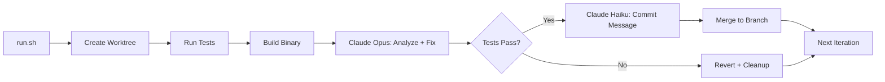

# Experiments

**Autonomous visual bug hunting for the Nebula CLI, inspired by [karpathy/autoresearch](https://github.com/karpathy/autoresearch).**

## Overview

An agent loop that captures the CLI state, spots visual bugs, fixes the source, and commits improvements. All overnight, zero human involvement.

## Quickstart

```bash
cd experiments/autoresearch
./run.sh 5
```

5 iterations of: build -> analyze -> fix -> test -> commit. That's it.

For VHS visual regression (screenshot comparison):

```bash
cd experiments/vhs
./run.sh
./compare.sh
```

## Why

Unit tests check struct fields, not what the user sees. Golden file tests catch text-level regressions but miss spacing, alignment, and color issues. The only way to catch visual bugs at scale is to **look at the actual rendered output** - and that's exactly what this does.

Karpathy's [autoresearch](https://github.com/karpathy/autoresearch) proved that a tight **observe-evaluate-fix loop** with a single metric can run 100 experiments overnight. We apply the same pattern to TUI quality: the metric is `passing_visual_checks / total_checks`, and the agent iterates until the score hits 1.0.

## Features

- **Autoresearch loop** - karpathy-style observe-fix-evaluate cycle with single score metric
- **Git worktree isolation** - each iteration runs in a throwaway worktree, merges only if tests pass
- **Smart commit messages** - Haiku generates conventional commits from the actual diff, Opus does the fixing
- **15 visual scenarios** - alignment, overflow, spacing, hierarchy, completeness, rendering checks
- **Gum styling** - nebula theme (#7f57b4 purple, #436b77 teal) throughout all scripts
- **VHS tape scripts** - 5 user flow recordings (startup, tab nav, CRUD, palette, search)
- **VHS CI workflow** - GitHub Actions for golden file + VHS regression (on-demand)

## Architecture



## Structure

```
experiments/
├── autoresearch/
│   ├── run.sh              # main loop
│   ├── evaluate.sh         # standalone evaluator
│   ├── program.md          # agent instructions (immutable)
│   ├── scenarios.json      # 15 visual check scenarios (immutable)
│   ├── prompts/            # analysis + fix prompt templates
│   └── reports/            # JSON results per run
└── vhs/
    ├── tapes/              # .tape flow scripts
    ├── baselines/          # reference PNGs
    ├── run.sh              # record all tapes
    ├── compare.sh          # diff against baselines
    └── update.sh           # regenerate baselines
```

## Dependencies

- [Claude Code](https://claude.com/claude-code) - Opus for fixes, Haiku for commits
- [gum](https://github.com/charmbracelet/gum) - styled terminal output
- [vhs](https://github.com/charmbracelet/vhs) - terminal session recording (optional)
- Go toolchain for building + testing nebula

## Status

Experimental. Runs on-demand locally, not in CI.

